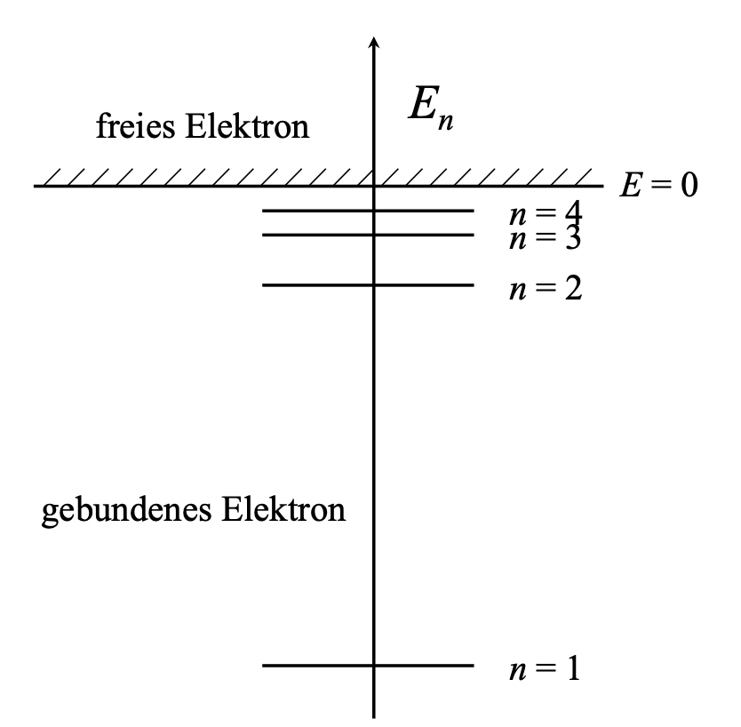

## Vorwort
### Vorsätze für Maßeinheiten
| Symbol | Name  | Wert       |
| ------ | ----- | ---------- |
| Y      | Yotta | $10^{24}$  |
| Z      | Zetta | $10^{21}$  |
| E      | Exa   | $10^{18}$  |
| P      | Peta  | $10^{15}$  |
| T      | Tera  | $10^{12}$  |
| G      | Giga  | $10^{9}$   |
| M      | Mega  | $10^{6}$   |
| k      | Kilo  | $10^{3}$   |
| h      | Hekto | $10^{2}$   |
| da     | Deka  | $10^{1}$   |
| -      | -     | $10^{0}$   |
| d      | Dezi  | $10^{-1}$  |
| c      | Zenti | $10^{-2}$  |
| m      | Milli | $10^{-3}$  |
| $\mu$      | Mikro | $10^{-6}$  |
| n      | Nano  | $10^{-9}$  |
| p      | Piko  | $10^{-12}$ |
| f      | Femto | $10^{-15}$ |
| a      | Atto  | $10^{-18}$ |
| z      | Zepto | $10^{-21}$ |
| y      | Yokto | $10^{-24}$ |

### Umrechnungsfaktor von Einheiten
$$1\,Bar=100000\,Pascal$$
$$y\,Kelvin = x\,Celsius+273.15$$

## Atomkern und Atomhülle
### Konstanten
Permittivität des Vakuums:$$\epsilon_0=8.854\cdot10^{-12}\,\frac{As}{Vm}$$Planck'sche Konstante:
$$h=6.626\cdot10^{-34}\,Ws^2$$Dirac'sche Konstante:
$$\hslash=\frac{h}{2\pi}$$
Elektronenmasse:
$$m_e=9.109\cdot10^{-31}\,kg$$
Elektronenladung:$$Q_e=−1.602\cdot10^{−19}\,C$$Lichtgeschwindigkeit:
$$c_0=299\,792\,458\,\frac{m}{s}$$

### Formeln
Gleichgewicht für ein Elektron, in der Umlaufbahn um ein Proton:$$F_c=F_z$$
Zentrifugalkraft einer Kreisbahn: $$F_z=m_e\cdot\frac{v^2}{r}$$Coulomb'sche Anziehungskraft: $$F_c=\frac{Q_1}{4\cdot\pi\cdot\epsilon_0}\cdot\frac{Q_2}{r^2}$$Gesamtenergie:
$$E_n=E_{kin}+E_{pot}=-\frac{e^4\cdot m_e}{8\cdot\epsilon_0^2\cdot h^2}\cdot\frac{1}{n^2}$$
Kinetische Energie: $$E_{kin}=\frac{m\cdot v^2}{2}$$Potentielle Energie:$$E_{pot}=\int_\infty^rF_c\,dr$$Photonenenergie:$$E_{Photon}=E_n-E_m=\Delta E=h\cdot f$$De Broglie Beziehung für die Wellenlänge: $$\lambda=\frac{h}{m\cdot v}=\frac{c}{f}$$Impuls:$$\vec{p}=m\cdot\vec{v}$$Bahnradius:$$r=\frac{1}{4\pi\cdot\epsilon_0}\cdot\frac{e^2}{m_e\cdot v^2}$$Bahndrehimpuls:$$\vec{L}=\vec{r}\times\vec{p}=(m\cdot\vec{v})\times\vec{r}=n\cdot\frac{h}{2\pi}$$Elektronen-Drehimpuls:$$L_e=\frac{1}{2}\cdot\frac{h}{2\pi}$$%%Anzahl der Umläufe eines Elektrons in einem Energieniveau:
$$n_{um}=\frac{e^4\cdot m_e}{4\cdot\epsilon_0\cdot n^3\cdot h^3}\cdot T^2$$%%
Energieniveaus des Wasserstoffatoms: 
Kapazität eines Plattenkondensators (mit Plattenfläche $A$ und Plattenabstand $d$):
$$C=\epsilon_0\cdot\epsilon_r\cdot\frac{A}{d}$$
Ladung eines Kondensators (mit Kapazität $C$ und angelegter Spannung $U$):
$$Q=C\cdot U$$
Feldstärke:
$$E=\frac{U}{d}$$
Kraft zwischen zwei Kondensatorplatten:
$$F=\frac{1}{2}\cdot E\cdot Q$$
## Bindungskräfte
### Ionenbindung
- Zwischen **Metall** (z.B. $Na$) und **Nichtmetall** (z.B. $Cl$).
- Immer zwischen **ungleichen Partnern**.
-  Elektronen gehen **komplett auf Partner** über. (**Vollstände** Abgabe bzw. Aufnahme der Außenelektronen der Partner.)
- Elektrostatische Anziehung.
- Die Bindungspartner haben Edelgaskonfiguration.
- Unterschiedliche Elektronegativität.
- Die Bindungspartner weisen kugelsymmetrische Ladungsverteilungen auf.
- Die Kräfte wirken richtungsunabhängig gleichermaßen auf alle Nachbarn.
- Es entsteht ein kontinuierliches Netzwerk: Der Ionenkristall.
- Gittertyp hängt  von Verhältnis der Ionenradien und Ladungszahl ab.
- Ionenkristalle sind Isolatoren.
- Ionenkristalle sind hart, spröde, nicht verformbar.
- Ionenkristalle weisen einen hohen Schmelzpunkt auf.
![[Gitterarten.png]]

### Kovalente Bindung
- Zwischen **Nichtmetall** (z.B. $H$) und **Nichtmetall** (z.B. $H$).
- Immer zwischen **gleichen Partnern**. (können auch gleichartig sein - z.B. $H$ und $H$)
- Die Bindungspartner **teilen** sich ihre Außenelektronen paarweise. (**Teilweise** Abgabe bzw. Aufnahme der Außenelektronen der Partner.)
- Elektrostatische Anziehung.
- Die Bindungspartner haben Edelgaskonfiguration.
- Die Bindung entsteht durch die erhöhte Aufenthaltswahrscheinlichkeit der Elektronen zwischen den Bindungspartnern. (durch **negativen Ladungsschwerpunkt** zwischen den Molekülatomen.)
  ![[Kovalente_Bindung.png]]
- Die Elektronenorbitale der Atome überlappen sich.
- Aufgrund der Richtungsabhängigkeit der Bindung zu den Nachbaratomen sind komplexe Molekülgeometrien möglich.
- Tendenziell sind kovalente Bindungen elektrische Isolatoren.
- Kovalente Bindungen haben hohe mechanische Stärke, hohe Steifigkeit und sind spröde.
- Kovalente Bindungen sind im Festkörperverbund ähnlich zu der Ionenbindung. Der Übergang zwischen beiden ist charakterisiert durch die Elektronennegativitätsdifferenz.
  ![[Elektronegativitätsdifferenz_Bindungen.png]]
### Metallische Bindung
- Zwischen **Metall** (z.B. ) und **Metall** (z.B. ).
* Die Außenelektronen sind schwach gebunden und leicht von den Atomrümpfen ablösbar.
* Die positiven Atomrümpfe sind von einem **Elektronengas** umgeben. Die Atomrümpfe können sich regelmäßig zu Gittern anordnern.
* Die Bindung der Elektronen wechselt zwischen Atomen.
* Frei bewegliche Elektronen: Hohe Stromleitfähigkeit, hohe thermische Leitfähigkeit, metallischer Glanz
* **Delokalisierte Elektronen**: Scherungen im Gitter sind möglich, Hohe Duktilität (plastische Verformbarkeit), 
* Die Beschreibung folgt durch das Bändermodell.
* Die Bindungen weisen eine geringe Elektronegativität auf. (Elektronen können leicht abgegeben werden.)
* Die Bindungen sind ungerichtet und unpolar.
![[Metallische_Bindung.png]]

### Zusammenfassung der Bindungsarten

| Ionische Bindung                                                 | Kovalente Bindung                                        | Metallische Bindung                                                |
| ---------------------------------------------------------------- | -------------------------------------------------------- | ------------------------------------------------------------------ |
| zw. Metall und Nichtmetall                                       | zw. Nichtmetall und Nichtmetall                          | zw. Metall und Metall                                              |
| Außenelektronen gehen **komplett** auf den Bindundspartner über. | Die Bindungspartner **teilen** sich die Außenelektronen. | Die positiven Atomrümpfe sind von einem **Elektronengas** umgeben. |
| Hohe Elektronegativitätsdifferenz                                | Niedrigere Elektronegativitätsdifferenz                  | Geringe Elektronegativitätsdifferenz                               |
| Ionengitter.                                                     | Komplexe Molekülgeometrien möglich.                      | Gitter aus Atomrümpfen, mit Elektronengas dazwischen.                                                                   |
| Elektrische Isolatoren                                           | Tendenziell elektrische Isolatoren                       | Elektrische Leiter                                                 |
| Hart, spröde, nicht verformbar.                                  | Hohe mechanische Stärke, steif, spröde.                  | Hohe Verformbarkeit, hohe Stromleitfähigkeit, thermisch Leitfähig. |
|Ungerichtete Bindungen.|Gerichtete Bindungen. | Ungerichtete Bindungen.                                                                  |

### Begriffe
Richtungsabhängigkeit:
- Voraussetzung ist ein Dipolmoment.
- Tritt üblicherweise bei nicht-symmetrischen Molekülen auf.

Koordinationszahl:
- Anzahl der nächsten Nachbarn einer Struktureinheit in einem Kristall. (z.B. Ionenkristall, Metallgitter)

Masseverhältnis:
$$\frac{m}{m_{ges}}$$

## Gase und Flüssigkeiten
### Konstanten
Boltzmann-Konstante:
$$k_B=1.38\cdot10^{-38}\,\frac{J}{K}$$
Universelle Gaskonstante:
$$R=k_B\cdot N_A=8.314\,\frac{J}{mol\cdot K}$$
Avogadro-Konstante:
$$N_A=6.022\cdot 10^{23}\,\frac{1}{mol}$$
### Formeln
Ideale Gasgleichung (mit der Stoffmenge $n$ in $Mol$, dem Druck $p$ in $Pascal$, der Temperatur $T$ in $Kelvin$, dem Volumen $V$, der universelle Gaskonstante $R$ in $\frac{J}{molK}$):
$$p\cdot V=n\cdot R\cdot T$$
Dichte:
$$\rho=\frac{m}{V}$$
Anzahl der Teilchen (mit der Stoffmenge $n$):
$$N=n\cdot N_A$$
Masse (mit Molekülmasse $M$, Stoffmenge $n$ und Anzahl der Teilchen $N$):
$$m=M\cdot n=M\cdot\frac{N}{N_A}$$
Volumen für **ein** Molekül (mit Molekülmasse $M$, Dichte $\rho$ und Anzahl der Teilchen $N=1$):
$$V=\frac{m}{\rho}=\frac{M\cdot\frac{N}{N_A}}{\rho}=\frac{M\cdot N}{N_A\cdot\rho}=\biggl\vert_{N=1}\,\frac{M}{N_A\cdot\rho}$$
## Kristalle
### Konstanten

### Formeln
![[Gitterarten.png]]
Packungsdichte:
$$p=\frac{Volumen\,der\,Atome}{Volumen\,der\,Einheitszelle}$$
Volumen einer Kugel / eines Atoms (mit Radius $r$):
$$V_{Kugel}=\frac{4}{3}\cdot\pi\cdot r^3$$
Volumen der Einheitszelle (mit Kantenlänge $a$):
$$V_{Einheitszelle}=a^3$$
